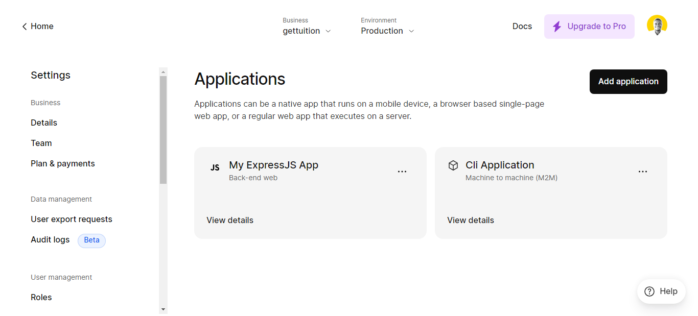
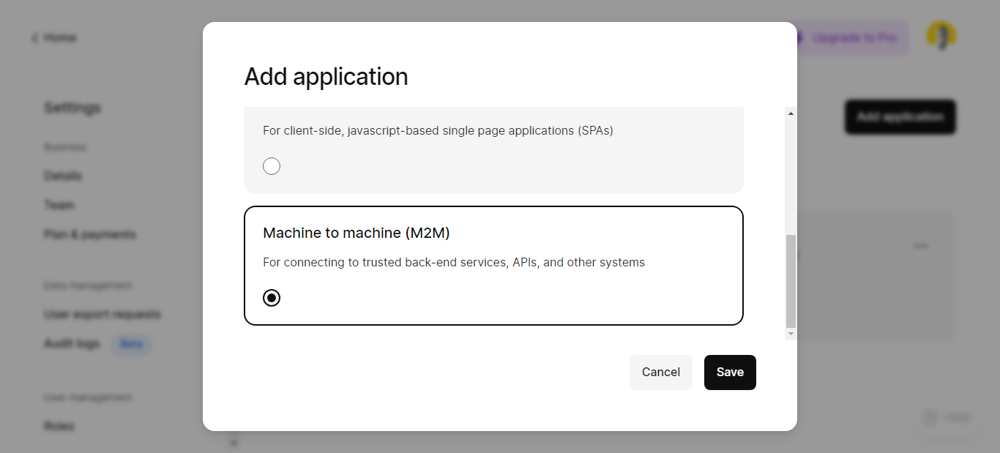
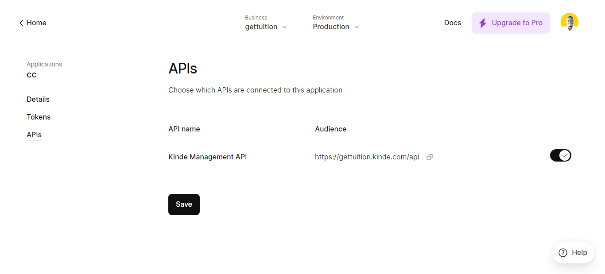
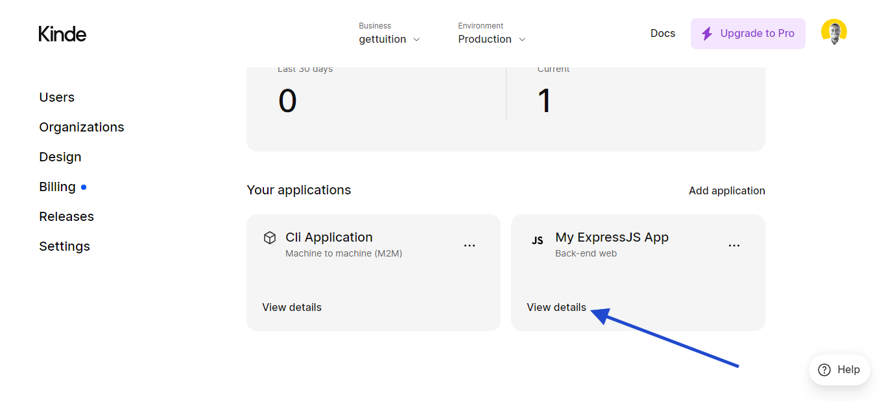
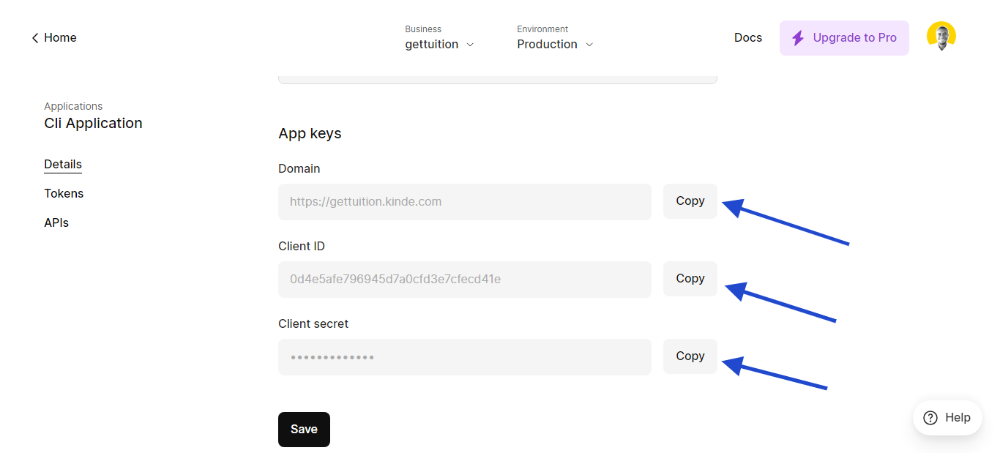

<!-- Update this link with your own project logo -->

#  Kinde CLI

Kinde is an alternative way of doing auth, kind of like clerk but better because it's been built with developers and startups in mind, save costs and achieve more free up 10,500 users. [Kinde](https://kinde.com)

<!-- Find new badges at https://shields.io/badges -->

This CLI some of the functionality for Kinde:

- [x] Authentication via Access Token for M2M

- [ ] Users
  - [ ] Refresh User Claim
  - [ ] Get User
  - [ ] Create User
  - [ ] Update User
  - [ ] Delete User
  - [ ] Update User Feature Flag
- [x] Permissions
  - [ ] List Permission
  - [x] Create Permission
  - [x] Update Permission
  - [ ] Delete Permission
- [ ] Roles
  - [ ] List Roles
  - [x] Create Roles
  - [x] Update Roles
  - [x] Delete Roles
- [x] Business
  - [x] List Business details
  - [x] Update Business details

## Getting Started

On your Kinde dashboard, create a new application call it CLI for convenience and choose Machine to Machine (M2M) option then click save to continue and then tab on the left click on API(s) then enable the api to connect this application to; copy your domain, client id and client secret you will need this to login.







### Install the CLI

Available on NPM. To install:

```bash copy
npm install -g kinde-cli
```

## Usage

```bash
kinde-cli --help
```

|      Flag      |           Description            |
| :------------: | :------------------------------: |
| `-h`, `--help` | Show this help message and exit. |

### Usage

Run the program from the command line like this:

- To use this CLI make sure you are authenticated by calling `npx kinde-cli login`

```bash
kinde-cli login
```

- Manage your permissions

```bash
kinde-cli permission
```

- Can be used with npx as well

```bash
npx kinde-cli permission
```

### Todo

- [ ] Input Validation
- [ ] Error Handling
- [x] Request Retry Logic

### Note

Not all the features of kinde are currently supported and there maybe a lot of breaking changes.

### Documentation

Kinde api documentation can be found here:
(Kinde)[https://kinde.com/api/docs]

## Contributing

<!-- Remember to update the links in the `.github/CONTRIBUTING.md` file from `Cutwell/readme-template` to your own username and repository. -->

For more information on how to use Kinde please consult their documentation

## License

MIT
